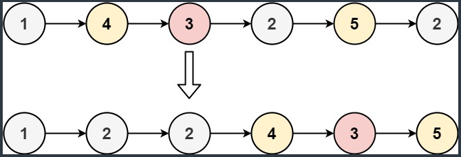
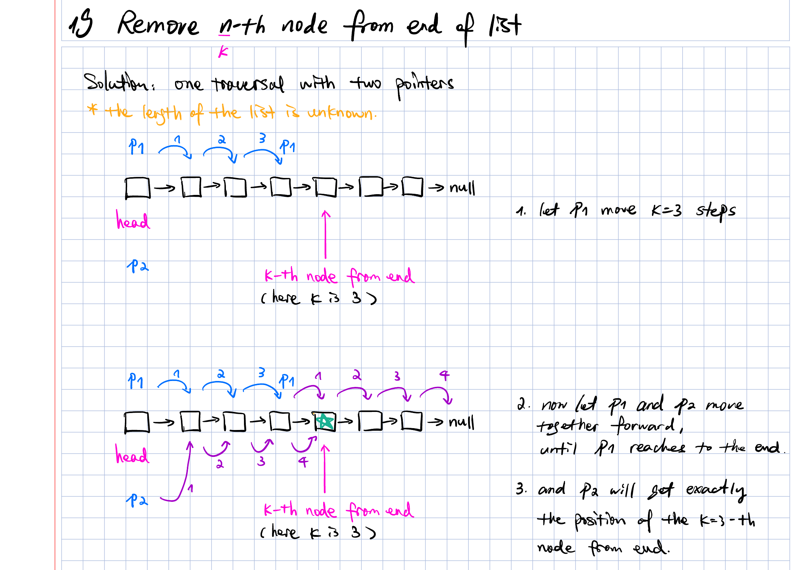

# List

## 21 Merge two sorted lists

## 86 Partition list



1. traverse the original list
2. move the node with value less than x to the list 1 (l1)
3. move the node with value greater or equal than x to the list 2 (l2)
4. merge two lists (like 21)


## 23 Merge k sorted lists

### Using priority-queue to sort automatically

```python
import heapq
pq = []
heapq.heappush(pq, (head.val, i, head))
val, i, node = heapq.heappop(pq)
```


## 19 remove n-th node from end of list


How can we find the k-th node from back of the single linked list?

- if find the k-th node from the front, then is easy
  - we only need to traversal the list once
- but how about from back
### two times traversal
- we don't know the length of the list
- k-th node from back is the (n-k+1)-th node from the front
- we can traversal first to get n and then with second traversal
- two times traversal is not optimal
- how can we solve it with one time traversal???

### one time traversal solution
- using two pointers p1, p2
- p1 points to the head of the list and move from the front k steps
- using p2 to point the head of the list
- p1 and p2 start together to move from the front
- stop when p1 reaches the end of the list, so p1 moves (n-k) steps
- i.e. p2 moves (n-k) steps and stop at the position (n-k+1), which is exactly the k-th position from the back of the list

- hand writing solution


- implementation with java
  ```java
  ListNode findFromBack (ListNode head, int k) {
    ListNode p1 = head;
    // p1 move k steps
    for (int i = 0; i < k; i++) {
      p1 = p1.next;
    }
    // p2 points to the head
    ListNode p2 = head;
    // p1 and p2 move together until p1 reaches the end of list
    while (p1 != null) {
      p1 = p1.next;
      p2 = p2.next;
    }
    // p2 points now to the k-th position from back
    return p2;
  }
  ```

- implementation with python
  ```python
  def findFromEnd(self, head: ListNode, k: int) -> ListNode:
      # 1. get two pointers 
      p1 = head
      p2 = head

      # 2. let p1 move k steps
      for i in range(k):
          p1 = p1.next
      
      # 3. let p1 and p2 move together until p1 gets to the end/null
      while p1 != None:
          p1 = p1.next
          p2 = p2.next
      
      # 4. return p2 and it's at the exact position we want
      return p2
  ```

- find the (k+1)-th node from end, so that you can easily remove the k-th node by `x.next = x.next.next`


> Notice we use a dummy node (virtual head) trick. This helps avoid null pointer problems. For example, if the list has 5 nodes and you need to delete the 5th node from the end (the first node), you need to find the 6th node from the end. But there is no node before the head, so you will have an error.
>
> With the dummy node, you can avoid this problem and handle all cases smoothly.
>
> Quote from: labuladong.online

## 876 Middle of the linked list

- using slow and fast pointer
- fast pointer move two times faster than slow pointer
- when fast pointer arrive the end (last node or the node after last node)
- the slow one arrive at the middle or the second of the middle if there are two


## 234 palindrome of linked list

- same reading from front and back is the key to recognize a palindrome
- 

### recursion

- left node at the beginning

